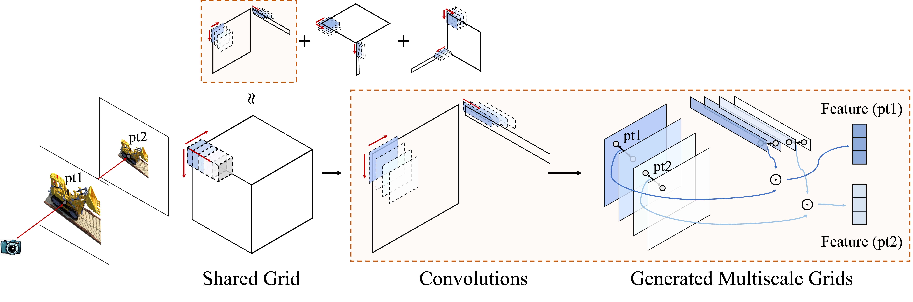

# Mip-Grid: Anti-aliased Grid Representations for Neural Radiance Fields
### [Project Page](https://stnamjef.github.io/mipgrid.github.io/) | [Paper](https://openreview.net/pdf?id=BW6nZf7TnK)

[Seungtae Nam](https://github.com/stnamjef),
[Daniel Rho](https://daniel03c1.github.io/),
[Jong Hwan Ko](https://iris.skku.edu/),
[Eunbyung Park](https://silverbottlep.github.io/)*\
*Corresponding author\
in Neural Information Processing Systems (NeurIPS), 2023

# Architecture overview

* Mip-Grid **generates multi-scale grids** by applying convolution to a single-scale grid with **learnable kernels**.
* Two multi-scale grids **closest to given scales are interpolated**.

# Environment setup
#### 1. Install Docker and NVIDIA Container Toolkit
* please follow the official [document](https://docs.nvidia.com/datacenter/cloud-native/container-toolkit/install-guide.html#docker) for installation.
* if you already installed both of them, please skip this part.

#### 2. Build the docker image
* run the command below at "/your/path/to/MipGrid".
* don't forget to include the dot . at the end.
```
docker build -t mipgrid_environment .
```

#### 3. Run the docker image
* run the command below at "/your/path/to/MipGrid".
* please also change the dataset path ("/your/path/to/dataset").
```
docker run -it \
    -v ./:/workspace \
    -v /hdd/stnamjef/dataset:/workspace/dataset \
    --ipc host \
    --gpus all \
    --name mipgrid \
    mipgrid_environment:latest
```

# Training
* run the commands below at "/your/path/to/mipTensoRF" inside the docker container.

* original TensoRF on the multi-scale Blender dataset.
```
bash ./scripts/blender/tensor_vm.sh
```

* single-scale TensoRF on the multi-scale Blender dataset.
```
bash ./scripts/blender/singlescale_tensor_vm.sh
```

* multi-scale TensoRF on the multi-scale Blender dataset.
```
bash ./scripts/blender/multiscale_tensor_vm.sh
```

* mipTensoRF (disc.) on the multi-scale Blender dataset.
```
bash ./scripts/blender/mip_tensor_vm_discrete.sh
```

* mipTensoRF (cont.) on the multi-scale Blender dataset.
```
bash ./scripts/blender/mip_tensor_vm_continuous.sh
```

* mipTensoRF (2D) on the multi-scale Blender dataset.
```
bash ./scripts/blender/mip_tensor_vm_2d.sh
```